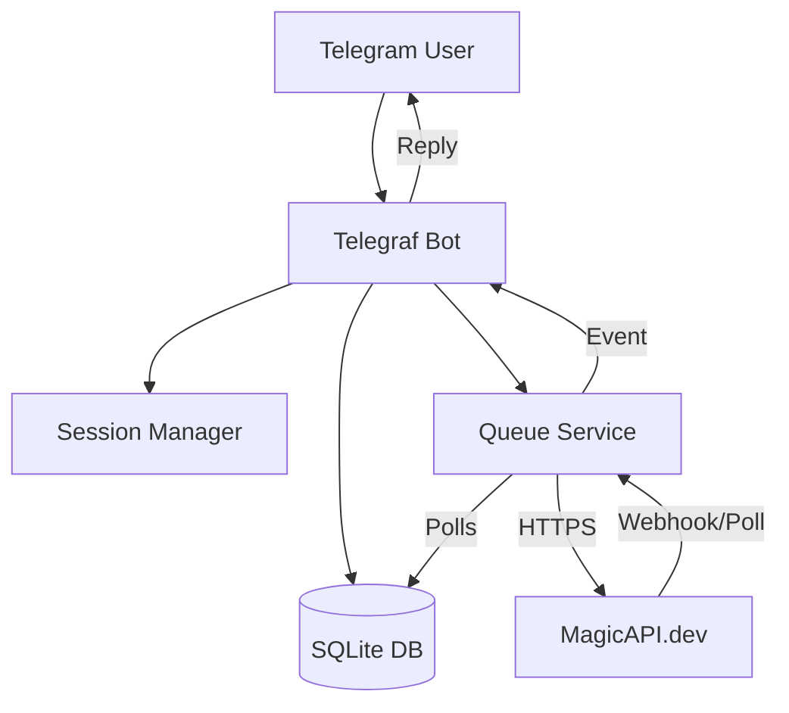

# Current Blockers & Technical Report

## 1. Legacy Implementation Failures
The previous system (`backend/server.js`) suffered from critical architectural flaws:

-   **Data Persistence:** Relied on `fs.writeFileSync` to a JSON file (`telegram_bot_data.json`). This is not ACID compliant. High risk of data corruption during concurrent writes or server crashes.
-   **Job Loss:** Pending jobs were stored in the same JSON file. If the file corrupted, all pending user jobs (and paid credits) were lost.
-   **Polling Instability:** Used recursive `setTimeout` inside `server.js`. Restarting the server would kill all active timers, requiring a complex "recovery" logic that was prone to bugs.
-   **Monolithic Structure:** 900+ lines in a single file made it nearly impossible to test or maintain.

## 2. Resource & Technical Constraints
-   **MagicAPI Rate Limits:** The bot does not currently handle 429 (Too Many Requests) gracefully.
-   **File Storage:** Downloads files to local `tmp` directory. On serverless platforms (Vercel/Render), this storage is ephemeral. Large video files might fill up the disk before cleanup runs.
-   **Telegram File Limits:** The bot uses `ctx.telegram.getFileLink` which works for files < 20MB. Larger videos sent by users might fail to download or be rejected by MagicAPI.

## 3. Areas for External Support
-   **Hosting Strategy:** The new prototype uses SQLite for reliability. This requires a **Persistent File System** (VPS, DigitalOcean Droplet, Railway with Volume). It **cannot** be deployed on Vercel/Netlify functions as-is.
    -   *Recommendation:* Use a VPS (Hetzner/DigitalOcean) or switch DB adapter to Supabase (PostgreSQL) for serverless support.
-   **GPU Costs:** As usage grows, MagicAPI costs will scale. Consider self-hosting InsightFace if volume > 1000 swaps/day.

# Validation Process & Testing Framework

## 1. Unit Testing
We use `jest` for unit testing.
-   **Database:** Test `createUser`, `updatePoints` to ensure transactions work.
-   **Queue:** Test that jobs are correctly picked up and marked as complete.

## 2. Integration Testing
-   **Flow Simulation:** Mock `Telegraf` context to simulate a user sending `/start`, clicking buttons, and sending photos.
-   **API Mocking:** Mock `axios` responses from MagicAPI to test success/failure handling without spending credits.

## 3. Performance Benchmarks
-   **Target:** Handle 50 concurrent jobs.
-   **Metric:** Time from "Photo Sent" to "Job Queued" < 2 seconds.
-   **Metric:** Polling overhead < 1% CPU.

# Knowledge Transfer & Documentation

## 1. Architecture Diagram


## 2. Deployment Procedures
1.  **Prerequisites:** Node.js 18+, Write access to disk (for SQLite).
2.  **Environment Variables:**
    ```
    BOT_TOKEN=123:abc...
    MAGICAPI_KEY=sk_...
    ADMIN_SECRET=...
    ```
3.  **Start:**
    ```bash
    npm install
    npm start
    ```

## 3. Troubleshooting
-   **Bot not responding:** Check `pm2 logs` or console. Verify `BOT_TOKEN`.
-   **"Not enough points" error:** Check `users` table in DB. Use Admin API to grant points.
-   **Jobs stuck in "processing":** Check `magic-api.log`. If MagicAPI is down, jobs will timeout after 10 mins (logic in `QueueService`).
